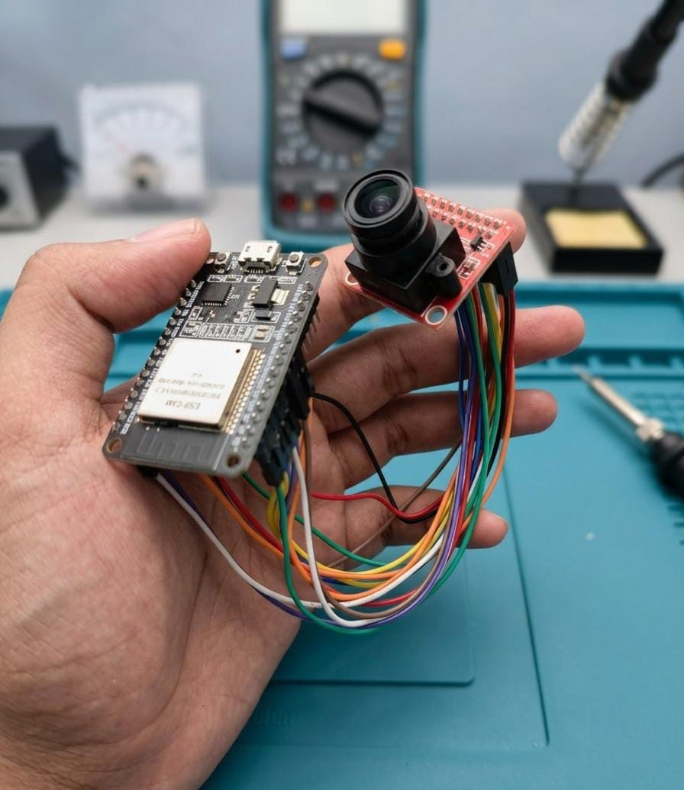
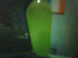

# ESP32-CAM No PSRAM Instructions

## Overview
This project supports an ESP32 DevKit 30-pin board without PSRAM and an OV2640 camera module.
The Arduino sketch captures raw camera frames and sends them over serial. Two Python tools receive or preview the frames on a PC.

## Files and Purpose
- `esp32cam_no_psram.ino`
  - Initializes the OV2640 camera.
  - Configures the camera for grayscale or RGB565 mode based on `CAMERA_COLOR_MODE`.
  - Uses internal DRAM-only frame buffer because no PSRAM is available.
  - Sends images over UART with a 7-byte header followed by raw payload.

- `receive_image.py`
  - Sends a capture trigger to ESP32.
  - Reads the frame header and payload over serial.
  - Reconstructs the image and saves it as `capture.png`.

- `stream_gui.py`
  - Opens a PyQt5 GUI for continuous live preview.
  - Repeatedly requests frames from ESP32 and displays them in a window.
  - Shows FPS and handles serial errors.

## Operation Instructions
1. Connect the ESP32 and OV2640 camera wires according to the pin mapping below.
2. Open `esp32cam_no_psram.ino` in Arduino IDE.
3. Edit `CAMERA_COLOR_MODE` if you want:
   - `1` = color RGB565 at QQVGA 160x120
   - `0` = grayscale at QVGA 320x240
4. Upload the sketch to the ESP32.
5. On the PC, install Python dependencies:
   - `pip install pyserial numpy pillow`
   - For GUI streaming: `pip install pyqt5`
6. Set the correct serial port in `receive_image.py` and `stream_gui.py`.
7. To capture one image:
   - Run `python receive_image.py`
   - The script will send `c` to the ESP32, receive a frame, and save `capture.png`.
8. To preview continuously:
   - Run `python stream_gui.py`
   - Click `Start` to begin streaming and `Stop` to end.

## Camera Pin Mapping
The sketch uses the following pin mapping to connect the OV2640 camera to the ESP32.

| Camera Signal | OV2640 Pin | ESP32 GPIO | Comment |
|---|---|---|---|
| PWDN | PWDN | 32 | Power-down control pin |
| RESET | RESET | -1 | Not used; camera RESET is tied to 3.3V |
| XCLK | XCLK | -1 | No external XCLK because camera has internal 12MHz oscillator |
| SCCB SDA | SIOD | 26 | I2C data line |
| SCCB SCL | SIOC | 27 | I2C clock line |
| D0 | Y2 | 5 | Camera data bit D0 |
| D1 | Y3 | 18 | Camera data bit D1 |
| D2 | Y4 | 19 | Camera data bit D2 |
| D3 | Y5 | 21 | Camera data bit D3 |
| D4 | Y6 | 36 | Camera data bit D4 |
| D5 | Y7 | 39 | Camera data bit D5 |
| D6 | Y8 | 34 | Camera data bit D6 |
| D7 | Y9 | 35 | Camera data bit D7 |
| VSYNC | VSYNC | 25 | Frame sync signal |
| HREF | HREF | 23 | Line sync signal |
| PCLK | PCLK | 22 | Pixel clock signal |

## Internal 12MHz Oscillator Info
- This OV2640 module includes its own internal 12MHz clock source.
- In the Arduino sketch, `XCLK_GPIO_NUM` is set to `-1`.
- That tells `esp_camera` not to generate an external XCLK signal.
- If your module does not have an internal oscillator, connect camera XCLK to ESP32 GPIO 0 and set `XCLK_GPIO_NUM` to `0`.

## Program Function Summary

### `esp32cam_no_psram.ino`
- `initCamera()`:
  - Configures pins, pixel format, frame size, frame buffer location, and grab mode.
  - Uses DRAM frame buffer because PSRAM is unavailable.
  - Prints mode and status to serial.
- `sendFrame()`:
  - Captures a frame from the camera.
  - Sends a 7-byte header plus the raw image payload over serial.
- `setup()`:
  - Starts serial at `921600` baud.
  - Initializes the camera.
- `loop()`:
  - Waits for the PC to send `c`.
  - When received, sends a captured frame.

### `receive_image.py`
- `wait_for_sync()`:
  - Scans serial data for the 0xAA 0x55 sync header.
- `read_frame()`:
  - Triggers ESP32 capture.
  - Reads header and payload.
  - Reconstructs grayscale or RGB565 image.
- `main()`:
  - Opens serial port, reads a frame, saves it as `capture.png`, and displays the image.

### `stream_gui.py`
- `CaptureThread`:
  - Runs serial capture in a background thread.
  - Sends `c` to ESP32, reads frame header and payload, emits `frame_ready`.
- `MainWindow`:
  - Builds a simple GUI with Start/Stop buttons and image display.
  - Converts raw frame arrays to `QImage`.
  - Shows current FPS and stream status.

## Result

